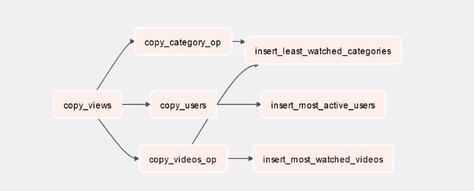

# Objective

To test your ability to create airflow pipeline

# Instructions

## Setup

Before anything else, check if there's any new updates by [syncing new updates to your private repository](https://gitlab.com/startupcampus.be/startup-campus-backend#sync-repository). Do this everytime you are notified that there are new updates.

Then create a new Merge Request for this assigment by following these steps:
- Go to your repo homepage (`https://gitlab.com/<your_gitlab_username>/startup-campus-backend`)
- From the left sidepanel, go to `Repository > Branches`
- Click `New Branch` button on the top right
- Input `assignment-7` on the Branch name, make sure you are creating from `main` branch and then click `Create branch`
- Wait until redirected to a new page with a notification that you just pushed to your new branch, click `Create merge request`
- In the `New merge request` page
  - Check **Squash commits ...** option on the bottom
  - Feel free to leave everything else as is
  - Click `Create Merge Request`

and you should be done! 

You can now start working on your local machine by clicking  `Code > Check out branch` from the new Merge Request page.

## Pre-work

- Make sure you already install docker and docker-compose

## Definition

In this assignment, you will try to do the following :
- create data pipeline that should be look like this
- 
- for copy views definition, open **importing_data/views.py**
- for copy category definition, open **importing_data/category.py**
- for copy users definition, open **importing_data/users.py**
- for copy videos definition, open **importing_data/users.py**
- for insert least watched categories definition, open **importing_data/least_watched_categories.py**
- for insert most active users definition, open **importing_data/most_active_users.py**
- for insert most watched videos definition, open **importing_data/insert_most_watched_videos.py**

Notes:
- all the leaf task should running only if it's parent already success

If you encounter any issues understanding the problem statement, feel free to ask and reach out to your mentors!

## Grading

Your grade will be mainly deduced by the amount of test cases you manage to pass across the whole problem sets and you mentor should be able to pull your docker image using `docker pull`. See Testing on how to check your live grades.

Mentors will also check your codes (in the Merge Request) to ensure no cheating attempts is performed.

## Testing

To test locally, go to the relative path for assignment 7
```
cd
cd startup-campus-backend/Assigments/Assignment7
```

then run
```
docker-compose up
```

- you will be able to access your airflow via localhost:8080
- open videos_dag and run your dag
- all your pipeline should be passed
- all table should be created in "destination" db with the correct data

grader will be announce soon

## Submission

- Push your changes to the branch (created via Merge Request) and simply **copy paste the Merge Request URL** into the corresponding **Assignment folder** in your **Google Classroom** account.
